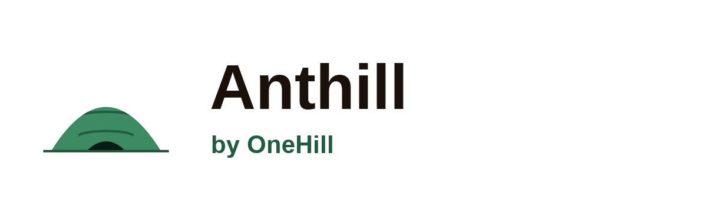

<div align="center">



**Your own AI - owned, not rented.**

[onehill.org](https://onehill.org) · [Architecture](ARCHITECTURE.md) · [Contributing](CONTRIBUTING.md) · [ASDD](https://github.com/OneHillAI/ASDD)

[](LICENSE)
[](https://python.org)
[](https://github.com/OneHillAI/Anthill/actions)
[](https://onehill.org)

</div>

---

This is the repository for **the Anthill project**: the open-source codebase, how it is built, and where
to contribute. If you only want to *run* Anthill, install the [Mac app](https://anthill.run/download) or
follow the deployment guide in [`CONTRIBUTING.md`](CONTRIBUTING.md); this README is for people who want to
build, extend, or operate it.

## What Anthill is, and what it is for

Anthill is a complete, self-hosted AI system you own. It runs open-weight models on your own
infrastructure, builds a self-maintaining wiki from what you and your team know, and trains fine-tuned
model weights you keep outright. Nothing leaves your machines. Run it **solo** on a single laptop, or
scale the same system across a **team** or a whole **organisation** - the on-ramp is one person, not a
deployment project.

**The goal is ownership.** When you use a hosted AI, your prompts and workflows train someone else's
model: the provider grows smarter on your data while you get a monthly bill and own nothing. Anthill exists
to give you ownership of your own AI - the knowledge it builds, the model it trains, and the infrastructure
it runs on - whether you are one person or a whole organisation, so that nothing can take that away, cut
off access, or bill per query. The AGPL v3 licence and the self-hosted architecture are the implementation
of that goal, not just technical choices.

It does three things, and says no to whatever competes with them:

- **Privacy.** It is yours. Open-weight models run in your own infrastructure; your prompts, documents, and
  embeddings never leave your machines unless you explicitly, visibly allow it.
- **Knowledge.** Your knowledge compounds into a structured, self-maintaining knowledge base. We did not
  invent a private format for it: we adopted the open
  [Open Knowledge Format (OKF)](https://github.com/GoogleCloudPlatform/knowledge-catalog) and extended it
  into **OKGF** (Open Knowledge and Governance Format), so your knowledge stays open, portable, diffable
  markdown that any OKF-aware tool can read, never locked into our database ([docs/OKGF.md](docs/OKGF.md)).
- **Model.** A model you own outright, fine-tuned on your own knowledge and served on your own hardware,
  portable to better base models as they arrive.

These three are also the project's development **core focus** (see [the five areas](#where-development-happens-the-five-areas)).
It is **built in the open by AI agents working under human direction** - a practice we call the **Anthill
Way** (below), which is how every contribution to this repo works.

## Quick start (from source)

```bash
git clone https://github.com/OneHillAI/Anthill
cd Anthill
make install      # create the venv and install dependencies
bash start.sh     # first run pulls the default model, generates secrets, opens the dashboard at :8000
```

The default model is `qwen2.5:3b` (runs in 8 GB RAM). Building the Mac app, the CLI, and self-hosting an
org backend (on-premises, neo cloud, or your own VPC) are all covered in [`CONTRIBUTING.md`](CONTRIBUTING.md).

## Architecture

A map for navigating the codebase; the authoritative design is [`ARCHITECTURE.md`](ARCHITECTURE.md).

- **Planes** (`anthill/planes.py`) - every conversation and task runs in a **solo**, **team**, or **org**
  plane. Solo is always local and offline-capable; team and org connect to a shared backend.
- **Inference + cache** (`anthill/inference/`, `anthill/cache/`) - a pluggable backend (Ollama or any
  OpenAI-compatible endpoint) behind a semantic cache that returns a stored answer above a cosine
  threshold (0.93 by default). A compute chooser runs the model on **your machine** or a GPU in **your
  cloud**; a **council** can run up to three open models in parallel and synthesise them into one answer;
  and an optional **inference provider** (Berget / Groq / Infercom) attaches only to escalate the hardest
  questions to a hosted frontier-scale open model, off unless you turn it on.
- **Knowledge** (`anthill/wiki/`) - the wiki, stored natively as **OKGF**, with human-reviewed promotion
  of pages up through the personal/team/org scopes. Imported knowledge is never trusted blindly.
- **Training** (`anthill/training/`) - `anthill export-training` produces gold data; `anthill
  train-adapter` fine-tunes a LoRA adapter on your own GPU backend.
- **Org backend** (`anthill/orchestrator/`, `anthill/node_agent/`) - an orchestrator (shared wiki, central
  index, coordination) that each user's local node connects to with `anthill serve --org-url ...`.
- **Governance** (`anthill/web/`, `.github/asdd/`) - MCP governance for the org brain, an audit
  log, and ASDD contribution pipeline that runs on every PR.

## Where development happens: the five areas

Every change belongs to exactly one area, carried as its PR lane tag. The three above (privacy, knowledge,
model) are the project's **core focus**; two **supported areas** let the community take Anthill further. A
change to a supported area can never weaken a core one - that is an enforced invariant, not a guideline.

### Core focus

- **Privacy** (`pillar:privacy`) - sovereignty. At-rest encryption, the audit log, access control, and the
  boundary that governs whether anything ever leaves your machines. Standing invariant: no change may
  weaken privacy.
- **Knowledge** (`pillar:knowledge`) - knowledge that compounds. The wiki and the OKGF substrate, the
  human-reviewed promotion gates that move knowledge up scopes, and retrieval.
- **Model** (`pillar:model`) - the whole model surface. Local-first inference and serving, on-device
  performance (quantisation, context, routing), the training pipeline that yields weights you own, and
  base-model portability across families.

### Supported

- **Platform** (`pillar:platform`) - what everything else runs on: CI, ASDD pipeline, packaging,
  deployment, and cloud provisioning.
- **Feature** (`pillar:feature`) - new user-facing capabilities (connectors, integrations, UI,
  collaboration). Features compose on top of the core and must respect its invariants.

Plus a `chore` lane for docs, tests, dependencies, and release mechanics. Open work is tracked in
[GitHub Issues](https://github.com/OneHillAI/Anthill/issues), labelled by area.

## How it is built: ASDD

Anthill is developed in the open by AI agents under human direction, governed by a pipeline that runs on
every PR. This is the project's **modus operandi**, and it is how *all* contributions work, whoever or
whatever writes them:

- **Disclose.** If an AI agent helped, say so; agents identify as agents in their commits and the PR.
- **Humans own the merges that matter.** Agents review and recommend; a human approves and merges anything
  on a protected path. Reviews are advisory first, never an auto-merge on what matters.
- **Gates, not suggestions.** A deterministic intake check (authorship disclosure, DCO sign-off, exactly
  one lane tag), a multi-lens review, and a security scan (deterministic rules plus SAST) run on every PR.
- **Any tool, or none.** Use Claude, Codex, Cursor, a local model, or your own hands - the gates enforce
  quality and security regardless of how a change was produced, so contribution stays open.
- **Agents that run.** A reviewer on every PR, and after every merge a test agent (the whole suite) and a
  documentation agent, each on an open model from a different family than the one that wrote the change. See
  [how ASDD runs here](docs/asdd-anthill-process.md).

Start at [`CONTRIBUTING.md`](CONTRIBUTING.md) for the four-item PR contract (sign-off, one lane label, the
disclosure, tests). ASDD is also packaged as a portable standard any project can adopt:
[OneHillAI/ASDD](https://github.com/OneHillAI/ASDD).

## Licensing

Anthill is **AGPL v3** (`AGPL-3.0-or-later`), copyright the Onehill Foundation and Anthill contributors.
Anyone, from a single individual to a large organisation, can run it, modify it, and build on it at no cost,
commercial use included. Run it as it ships, for yourself or your organisation, and the licence asks nothing
of you.

The copyleft condition applies in two cases: when you distribute Anthill or a modified version to others, and
when you let people use a modified version over a network, including your own staff on an internal
deployment. In both cases you must offer those people the complete source of your version under the same
AGPL terms.

If you want to do either without releasing your source - ship Anthill inside a closed product, or run a
modified version as a closed service - you need a commercial licence from the Onehill Foundation. That is
how contributors' work is protected: when a company turns the commons into a closed product, the commercial
licence ensures the project receives something back, and those proceeds fund the core contributors who keep
it running. See [`LICENSE`](LICENSE) and [`NOTICE`](NOTICE); for commercial licensing, contact
[foundation@onehill.org](mailto:foundation@onehill.org).

## Security

Passwords are bcrypt-hashed, sessions use signed JWTs backed by revocable server-side records and
per-user authentication generations, and sensitive fields are AES-256-GCM encrypted at rest. Every login,
wiki promotion, agent action, and data export is in the audit log. Components speak plain HTTP locally, so
expose the dashboard only behind a TLS-terminating reverse proxy (a self-signed
dev-cert scaffold for local mTLS is provided under `certs/`, but is not for production). The desktop app
and the launchers made for one person at one machine (`start.sh`, `make alpha`, the macOS auto-start agent,
`scripts/start.ps1`) treat requests from the machine itself as local and trusted, and a proxy or tunnel on the
same machine that adds no forwarding header (a default nginx `proxy_pass`, HAProxy without `forwardfor`, a
TCP forward such as `ssh -R`, `socat` or `ngrok tcp`) makes a remote request look local. Do not put them
behind a proxy or tunnel unless Remote access is switched on first (Settings, provider "manual"), or
`ANTHILL_LOCAL_ONLY=0` is set (this applies to `start.sh`, `make alpha`, the auto-start agent and
`start.ps1` only; the desktop app always marks itself local). Report
vulnerabilities privately: email [security@onehill.org](mailto:security@onehill.org), not a public
issue. See [`SECURITY.md`](SECURITY.md).

---

<div align="center">
Built by <a href="https://onehill.org">Onehill Foundation</a>
</div>
